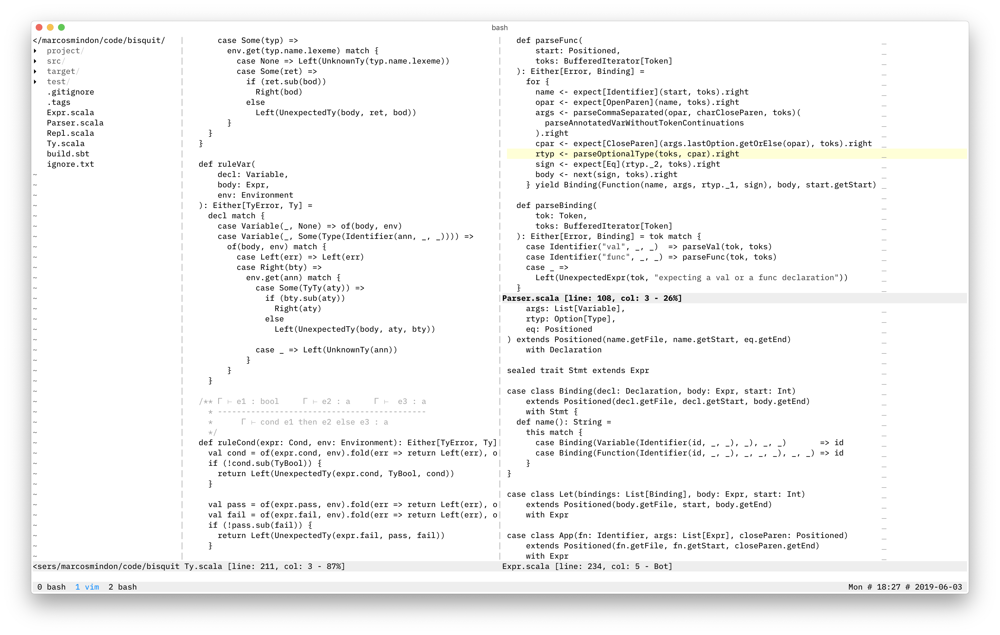

Vim Simple, a color scheme that just gets out of the way.

### Available configuration

```vim
let g:SimpleColBackground = get(g:, 'SimpleColBackground', '248')
let g:SimpleColCurrentLine = get(g:, 'SimpleColCurrentLine', '230')
let g:SimpleColError = get(g:, 'SimpleColError', '196')
let g:SimpleColScalar = get(g:, 'SimpleColScalar', '238')
let g:SimpleColURL = get(g:, 'SimpleColURL', '33')
```

### Screenshots

<!-- 150 x 50 -->



